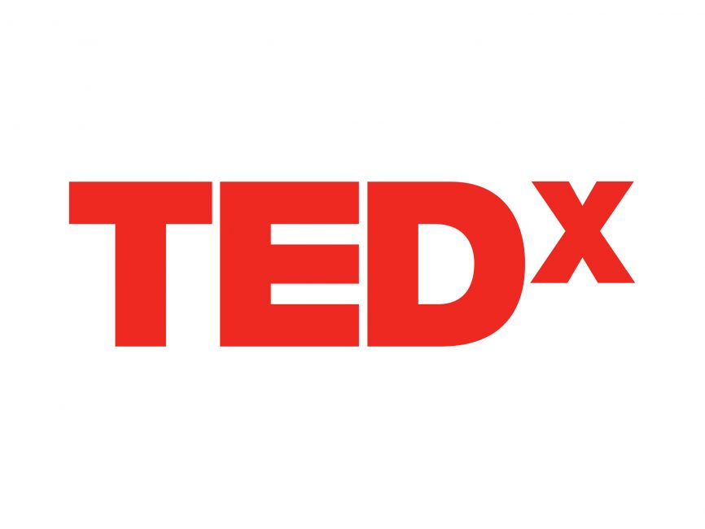

# TEDxTechnovium Algemeen

Tedx Technovium

Organisatie van een TEDx Show op ROC Nijmegen

### Inleiding 

In een wereld van voortdurende technologische vooruitgang is het van cruciaal belang dat onze studenten niet alleen theoretische kennis verwerven, maar ook worden geïnspireerd en in contact komen met professionals uit de industrie. Dit verslag beschrijft ons initiatief om maandelijks een TEDx show te organiseren in het Technovium-gebouw van ROC Nijmegen, gepland voor elke eerste maandag van de maand. Het doel is om onze studenten te inspireren, te motiveren en waardevolle verbindingen met professionals uit de technische sector te leggen.

Een sleutelelement van dit initiatief is onze samenwerking met Radboud Universiteit en de Hogeschool van Arnhem en Nijmegen (HAN). Door deze samenwerking willen we de kennis en middelen bundelen om een breder scala aan expertise en inspiratie te bieden. Dit stelt ons in staat om sprekers van wereldklasse aan te trekken en onze studenten te voorzien van de meest actuele inzichten.

Het hoofddoel van de TEDx show is om een platform te bieden waar vooraanstaande sprekers uit verschillende technische disciplines hun kennis en ervaringen kunnen delen. Hierdoor krijgen onze studenten een duidelijker beeld van de mogelijkheden en uitdagingen binnen hun vakgebied.

Daarnaast willen we met deze evenementen stageplekken voor onze studenten faciliteren en directe lijnen tussen onze talentvolle studenten en de industrie creëren. Dit biedt niet alleen waardevolle werkervaring, maar stelt bedrijven ook in staat om potentiële toekomstige werknemers te ontmoeten en te begeleiden.

Dit verslag behandelt uitvoerig de visie, planning en organisatie van de TEDx show. Het beschrijft de doelstellingen, selectie van sprekers en thema's, organisatorische aspecten, promotie, evaluatie en vervolgacties. Bovendien benadrukt het de samenwerking tussen verschillende opleidingseilanden om een cultuur van samenwerking en kennisuitwisseling te bevorderen.

Met dit verslag willen we niet alleen onze plannen voor de TEDx show uiteenzetten, maar ook de impact en voordelen benadrukken die dit evenement zal hebben op onze studenten en de bredere technische gemeenschap. We nodigen u uit om deel te nemen aan onze TEDx show en samen te streven naar een toekomst gebouwd op samenwerking, inclusiviteit en vooruitgang.

### Inhoudsopgave 

Contents

Inleiding 2

Inhoudsopgave 4

Doelstellingen van de TEDx show 7

1\. Inspiratie en Motivatie voor Studenten 7

2\. Verbeteren van Stage- en Werkgelegenheidskansen 7

3\. Versterken van de Samenwerking met Partnerinstellingen 7

4\. Promotie van Technovium als Centrum van Innovatie 8

5\. Creëren van een Levendige en Actieve Onderwijsgemeenschap 8

6\. Ontwikkeling van Presentatie- en Communicatievaardigheden 8

Selectie van Sprekers en Thema's 10

Thema's Geïnspireerd door Opleidingen 10

Selectiecriteria voor Sprekers 11

Diversiteit en Inclusie 12

Betrokkenheid van Bedrijven en Partnerinstellingen 12

Organisatorische Aspecten en Logistiek 13

Projectteam en Verantwoordelijkheden 13

Locatie en Faciliteiten 13

Technische Voorbereidingen 14

Promotie en Communicatie 14

Registratie en Toegangsbeheer 15

Evaluatie en Feedback 15

Promotie en Betrokkenheid van Studenten en Bedrijven 17

Promotiecampagne 17

a. Social Media Strategie 17

Betrokkenheid van Studenten 18

Samenwerking tussen Opleidingseilanden: Een Nieuw Perspectief via TEDx 21

Stimuleren van Samenwerking 21

Evaluatie en Vervolgacties 23

Conclusie: Duurzaamheid en Toewijding voor een Beter Morgen 25

Video Script 27

Video 29

TODO: 30

### Doelstellingen van de TEDx show 

Het organiseren van een TEDx show bij ROC Nijmegen, in samenwerking met Radboud Universiteit, de Hogeschool van Arnhem en Nijmegen (HAN), en diverse bedrijven uit de technische sector, heeft diverse doelstellingen die zowel onze studenten als de bredere technische gemeenschap ten goede komen. De belangrijkste doelstellingen zijn als volgt:

### 1. Inspiratie en Motivatie voor Studenten 

De TEDx show is bedoeld om onze studenten te inspireren door hen in contact te brengen met baanbrekende ideeën, innovatieve projecten en persoonlijke succesverhalen uit de wereld van technologie. Door maandelijkse presentaties van sprekers die excelleren in hun vakgebied, willen we een cultuur van nieuwsgierigheid, ambitie en doorzettingsvermogen bevorderen. Dit zal studenten motiveren om hun eigen potentieel te ontdekken en na te streven.

### 2. Verbeteren van Stage- en Werkgelegenheidskansen 

Een van de primaire doelstellingen is om directe verbindingen te leggen tussen onze studenten en de industrie. Door professionals en bedrijven uit te nodigen om deel te nemen aan de TEDx shows, bieden we een platform voor netwerken en het ontdekken van stage- en werkgelegenheidsmogelijkheden. Dit initiatief stelt bedrijven in staat om hun toekomstige werknemers te ontmoeten en biedt studenten waardevolle kansen om werkervaring op te doen in een professionele omgeving.

### 3. Versterken van de Samenwerking met Partnerinstellingen 

Door samen te werken met Radboud Universiteit, HAN en diverse bedrijven, streven we naar een integratie van kennis en expertise uit verschillende academische, technische en industriële disciplines. Deze samenwerking zal niet alleen bijdragen aan de kwaliteit en diversiteit van de sprekers, maar ook aan de academische en professionele groei van onze studenten. Het gezamenlijke platform biedt een unieke gelegenheid om middelen te delen, gezamenlijke projecten te initiëren en innovatieve oplossingen te ontwikkelen.

### 4. Promotie van Technovium als Centrum van Innovatie 

Het positioneren van Technovium als een toonaangevend centrum voor technologische innovatie is een belangrijke doelstelling van de TEDx show. Door regelmatige evenementen te organiseren die zowel lokaal als nationaal aandacht trekken, willen we de reputatie van ROC Nijmegen versterken als een instituut dat voorop loopt in technologische ontwikkeling en educatie met AI. Dit zal niet alleen toekomstige studenten aantrekken, maar ook samenwerkingen met bedrijven en onderzoeksinstellingen bevorderen.

### 5. Creëren van een Levendige en Actieve Onderwijsgemeenschap 

De TEDx shows zijn bedoeld om een levendige en actieve onderwijsgemeenschap te creëren, waar studenten, docenten, bedrijven en professionals regelmatig samenkomen om ideeën uit te wisselen en te leren van elkaar. Dit bevordert een cultuur van continue leren en samenwerking, wat essentieel is in de snel evoluerende wereld van technologie.

### 6. Ontwikkeling van Presentatie- en Communicatievaardigheden 

Een bijkomend doel is om studenten de kans te geven hun presentatie- en communicatievaardigheden te ontwikkelen. Door bijvoorbeeld studenten te betrekken bij de organisatie van de evenementen of hen uit te nodigen als gastsprekers, bieden we hen de mogelijkheid om hun vaardigheden te oefenen en te verbeteren in een professionele setting.

Voor elke opleiding is het belangrijk dat studenten hun werk presenteren, wat in bijna elk kwalificatiedossier van MBO-opleidingen verplicht is. Door deze doelstellingen na te streven, willen we een blijvende impact creëren op de professionele en persoonlijke ontwikkeling van onze studenten en bijdragen aan de vooruitgang van de technische gemeenschap in Nijmegen en daarbuiten.

### Selectie van Sprekers en Thema's 

Een cruciaal onderdeel van de TEDx show op ROC Nijmegen is de selectie van sprekers en thema's. Het doel is om een divers en inspirerend programma te creëren dat aansluit bij de brede scala aan opleidingen die binnen het Technovium-gebouw worden aangeboden. Dit varieert van softwareontwikkeling tot bouwkunde, en van elektrotechniek tot media design. Hieronder volgt een plan voor de selectie van sprekers en de thematische indeling van de shows:

### Thema's Geïnspireerd door Opleidingen 

Om de relevantie en betrokkenheid van de studenten te maximaliseren, zullen de thema's van de TEDx shows nauw aansluiten bij de verschillende opleidingen binnen Technovium. Enkele mogelijke thema's zijn:

* Software Development en ITSD (ICT en Beheer): Innovaties in softwareontwikkeling, cybersecurity, en de toekomst van IT-beheer.
* Timmerman en Bouwkunde: Duurzame bouwtechnieken, architectonische innovaties, en toekomstbestendige infrastructuur.
* Elektroinstallatie en Elektrotechniek: Nieuwe ontwikkelingen in elektrotechniek, slimme netwerken, en duurzame energieoplossingen.
* Mechatronica: Automatisering, robotica, en de integratie van mechanische en elektronische systemen.
* Media Design: Trends in digitale media, grafisch ontwerp, en interactieve technologieën.
* Werktuigbouwkunde: Innovaties in werktuigbouwkunde, productieprocessen, en materiaaltechnologie.
* Autotechniek: De toekomst van transport, elektrische voertuigen, en slimme mobiliteitsoplossingen.

### &#x20;Selectiecriteria voor Sprekers 

De selectie van sprekers zal gebaseerd zijn op hun expertise, relevantie voor het thema en het vermogen om studenten te inspireren en te motiveren. Enkele criteria zijn:

* Expertise en Ervaring: Sprekers moeten aantoonbare expertise hebben in hun vakgebied en relevante werkervaring die aansluit bij de thema's.
* Inspirerend Verhaal: Sprekers moeten in staat zijn om hun verhaal op een boeiende en inspirerende manier over te brengen, waarbij ze studenten motiveren om hun eigen doelen na te streven.
* Innovatieve Bijdragen: Sprekers die betrokken zijn bij innovatieve projecten of baanbrekende onderzoeken, worden sterk aangemoedigd om hun ervaringen te delen.
* Relevantie voor Studenten: De inhoud van de presentaties moet direct relevant zijn voor de opleidingen en de toekomstige carrières van de studenten.

### Diversiteit en Inclusie 

Het is belangrijk om een diverse groep sprekers te selecteren die verschillende perspectieven en achtergronden vertegenwoordigen. Dit zal niet alleen de breedte van de onderwerpen vergroten, maar ook de inclusiviteit binnen de TEDx shows bevorderen. Het streven is om sprekers te hebben die verschillende demografische en professionele achtergronden vertegenwoordigen, waaronder vrouwen en minderheden in technische beroepen.

### Betrokkenheid van Bedrijven en Partnerinstellingen 

Naast academici en onderzoekers, zullen ook vertegenwoordigers van bedrijven en partnerinstellingen zoals Radboud Universiteit en HAN worden uitgenodigd om te spreken. Dit zal de band tussen onderwijs en industrie versterken en praktische inzichten bieden die direct toepasbaar zijn in de werkwereld. Bedrijven kunnen bijvoorbeeld sprekers leveren die praten over actuele trends, innovatieve projecten of hun ervaringen met stageprogramma's en het aannemen van nieuwe talenten.

Door zorgvuldig geselecteerde sprekers en relevante thema's, zal de TEDx show niet alleen een bron van inspiratie en kennis zijn, maar ook een belangrijke brug slaan tussen onderwijs en de praktijk. Dit zal de professionele en persoonlijke ontwikkeling van onze studenten ondersteunen en hen voorbereiden op een succesvolle toekomst in hun gekozen vakgebied.

### Organisatorische Aspecten en Logistiek 

Het succesvol organiseren van een TEDx show op ROC Nijmegen vereist gedetailleerde planning en coördinatie. Hieronder worden de belangrijkste organisatorische aspecten en logistieke overwegingen uiteengezet:

### Projectteam en Verantwoordelijkheden 

Het vormen van een dedicated projectteam is essentieel voor de succesvolle uitvoering van de TEDx show. Het team zou idealiter bestaan uit:

*
  * Projectleider: Verantwoordelijk voor de algehele coördinatie en communicatie tussen de teamleden en stakeholders.
  * Sprekerscoördinator: Zorgt voor de werving, selectie en begeleiding van de sprekers.
  * Logistiek Coördinator: Beheert alle logistieke aspecten, waaronder locatie, catering, en technische ondersteuning.
  * Marketing en PR Coördinator: Verantwoordelijk voor de promotie van het evenement, inclusief sociale media, posters, en persberichten.
  * Studentenvertegenwoordigers: Helpen bij de organisatie en promotie onder de studenten en bieden feedback om de inhoud en uitvoering te verbeteren.

### Locatie en Faciliteiten 

Het Technovium-gebouw biedt verschillende faciliteiten die geschikt zijn voor het houden van TEDx shows. Enkele belangrijke aspecten zijn:

*
  * Hoofdzaal: Een ruime en goed uitgeruste zaal voor de presentaties, met voldoende zitplaatsen voor studenten, docenten en genodigden.
  * Audiovisuele Apparatuur: Hoogwaardige projectoren, geluidssystemen en opnameapparatuur om de presentaties professioneel weer te geven en op te nemen.
  * Breakout Rooms: Extra ruimtes voor workshops, netwerksessies of kleinere interactieve sessies.
  * Catering: Voorzieningen voor snacks en drankjes tijdens de pauzes, evenals een netwerkborrel na afloop van het evenement.

### Technische Voorbereidingen 

Zorg ervoor dat alle technische aspecten goed geregeld zijn om een vlekkeloze uitvoering van de TEDx show te garanderen:

*
  * Audiovisuele Testen: Voer vooraf uitgebreide tests uit van alle audiovisuele apparatuur om technische problemen tijdens het evenement te voorkomen.
  * Livestreaming: Overweeg het opzetten van een livestream voor diegenen die niet fysiek aanwezig kunnen zijn, waardoor het bereik van het evenement wordt vergroot.
  * Opname en Archivering: Neem alle sessies op en archiveer deze voor toekomstig gebruik. Dit kan ook als educatief materiaal worden gebruikt voor studenten die het evenement hebben gemist.

### Promotie en Communicatie 

Een uitgebreide promotiecampagne is noodzakelijk om ervoor te zorgen dat het evenement goed bezocht wordt en maximale impact heeft:

*
  * Social Media Campagne: Gebruik platforms zoals Instagram, Facebook, LinkedIn en Twitter om het evenement te promoten. Creëer interessante content, zoals teaser video's en interviews met de sprekers.
  * Posters en Flyers: Verspreid promotiemateriaal door het hele Technovium-gebouw en op andere relevante locaties binnen ROC Nijmegen.
  * Email Nieuwsbrieven: Stuur e-mailuitnodigingen naar studenten, docenten en andere belanghebbenden. Gebruik bestaande mailinglijsten om een breed publiek te bereiken.
  * Samenwerking met Bedrijven en Partnerinstellingen: Vraag partnerbedrijven en instellingen om het evenement te promoten via hun kanalen, zoals nieuwsbrieven, websites en sociale media.

### Registratie en Toegangsbeheer 

Om de logistiek van het evenement soepel te laten verlopen, is een goed systeem voor registratie en toegangsbeheer nodig:

*
  * Online Registratie: Gebruik een online platform voor de registratie van deelnemers. Dit kan ook helpen om een inschatting te maken van het aantal bezoekers.
  * Check-in Procedure: Organiseer een efficiënt check-in proces bij de ingang van het evenement, bijvoorbeeld met behulp van QR-codes of naamplaatjes.
  * Bezoekersbeheer: Zorg voor voldoende personeel om bezoekers te begeleiden en te assisteren tijdens het evenement.

### Evaluatie en Feedback 

Na afloop van het evenement is het belangrijk om de resultaten te evalueren en feedback te verzamelen:

*
  * Enquêtes: Stuur enquêtes naar deelnemers en sprekers om hun feedback te krijgen over de organisatie, inhoud en algemene ervaring.
  * Debriefing: Organiseer een debriefing sessie met het projectteam om de sterke punten en verbeterpunten te bespreken.
  * Rapportage: Stel een gedetailleerd rapport op over het evenement, inclusief statistieken over de opkomst, feedback van de deelnemers en aanbevelingen voor toekomstige evenementen.

Door deze organisatorische en logistieke aspecten zorgvuldig te plannen en uit te voeren, kunnen we ervoor zorgen dat de TEDx show op ROC Nijmegen een groot succes wordt en een blijvende impact heeft op onze studenten en de bredere technische gemeenschap.

### Promotie en Betrokkenheid van Studenten en Bedrijven 

Het succes van de TEDx show op ROC Nijmegen hangt sterk af van effectieve promotie en de actieve betrokkenheid van zowel studenten als bedrijven. Hieronder worden de belangrijkste strategieën en acties beschreven om deze betrokkenheid te stimuleren:

### Promotiecampagne 

### a. Social Media Strategie 

* Platformen: Gebruik populaire platforms zoals Instagram, Facebook, LinkedIn, Twitter en TikTok om het evenement te promoten.
* Content: Creëer boeiende en deelbare content, zoals teaser video's, interviews met aankomende sprekers, en behind-the-scenes beelden van de voorbereidingen.
* Hashtags: Gebruik specifieke hashtags zoals #TEDxTechnovium, #ROCInspireert, en #InnovatieNijmegen om de zichtbaarheid te vergroten en een online community op te bouwen.

b. Website en Email Nieuwsbrieven

* Dedicated Webpagina\*\*: Ontwikkel een speciale pagina op de ROC Nijmegen website die alle informatie over het TEDx evenement bevat, inclusief het programma, sprekersprofielen en registratie-instructies.
* Email Campagnes: Stuur regelmatige nieuwsbrieven naar studenten, docenten, alumni en bedrijven om hen op de hoogte te houden van het evenement en hen aan te moedigen om zich in te schrijven en deel te nemen.

c. Traditionele Promotie

* Posters en Flyers: Verspreid promotiemateriaal door het hele Technovium-gebouw, op andere campussen van ROC Nijmegen, en op strategische locaties in de stad.
* Persberichten: Stuur persberichten naar lokale media om publiciteit te genereren en een breder publiek te bereiken.

### Betrokkenheid van Studenten 

a. Student Ambassadors

\- Ambassadeursprogramma: Stel een team van enthousiaste studenten samen die als ambassadeurs voor het evenement fungeren. Zij kunnen helpen bij de promotie, het verspreiden van informatie en het werven van andere studenten om deel te nemen.

\- Social Media Takeovers: Laat student-ambassadeurs social media accounts van de school overnemen om het evenement te promoten en hun persoonlijke ervaringen te delen.

b. Participatie in de Organisatie

\- Vrijwilligerswerk: Bied studenten de mogelijkheid om als vrijwilliger te werken tijdens de organisatie en uitvoering van het evenement. Dit kan variëren van logistieke ondersteuning tot het assisteren van sprekers.

\- Stageprojecten: Integreer de organisatie van de TEDx show in stageprojecten of vakken, waardoor studenten hands-on ervaring opdoen in event management, marketing en communicatie.

c. Interactieve Sessies en Workshops

\- Breakout Sessies: Organiseer interactieve breakout sessies en workshops tijdens het evenement, waarin studenten actief kunnen deelnemen en in discussie kunnen gaan met de sprekers en andere professionals.

\- Feedback Sessies: Creëer mogelijkheden voor studenten om feedback te geven en hun ideeën te delen over toekomstige TEDx shows.

3\. Betrokkenheid van Bedrijven

a. Partnerschappen en Sponsoring

\- Sponsorpakketten: Ontwikkel verschillende sponsorpakketten die bedrijven kunnen afnemen, variërend van financiële bijdragen tot in-kind donaties zoals technologie, catering of promotiemateriaal.

\- Samenwerkingsverbanden: Werk samen met bedrijven om sprekers te werven en thema's te ontwikkelen die relevant zijn voor zowel de industrie als de studenten.

b. Netwerkopportuniteiten

\- Netwerkmomenten: Organiseer netwerkborrels en meet-and-greet sessies na de presentaties, waar studenten en bedrijven informeel met elkaar in contact kunnen komen.

\- Bedrijfspresentaties: Geef bedrijven de mogelijkheid om korte presentaties te geven over hun stageprogramma's, vacatures en innovaties.

c. Promotionele Activiteiten

\- Bedrijfspromotie: Bied bedrijven die deelnemen aan de TEDx show de mogelijkheid om hun merk te promoten via het evenement, bijvoorbeeld door logo's op promotiemateriaal, stands tijdens het evenement, en vermeldingen op de website en in nieuwsbrieven.

\- Gastbloggen en Interviews: Nodig vertegenwoordigers van bedrijven uit om gastblogs te schrijven of interviews te geven die op de ROC Nijmegen website en social media worden geplaatst.

Door een strategische en uitgebreide promotiecampagne te voeren, en door zowel studenten als bedrijven actief te betrekken, kunnen we ervoor zorgen dat de TEDx show op ROC Nijmegen een groot succes wordt. Dit zal niet alleen leiden tot een inspirerend evenement, maar ook tot waardevolle netwerkmogelijkheden en versterkte samenwerkingsverbanden tussen onderwijs en industrie.

### Samenwerking tussen Opleidingseilanden: Een Nieuw Perspectief via TEDx 

TODO: HIER MEER OVER!!!!! Want dit is meest belangrijkste!! We weten dat er altijd paar zijn in het team die wel inovatief zijn!

\
Op Technovium, waar een breed scala aan opleidingen wordt aangeboden, is het niet ongewoon dat er zich "eilanden" van expertise vormen. Deze isolatie kan de samenwerking tussen verschillende disciplines bemoeilijken en de mogelijkheden voor synergie beperken. De TEDx show biedt een unieke kans om deze barrières te doorbreken en een cultuur van samenwerking en cross-disciplinaire uitwisseling te bevorderen.

### Stimuleren van Samenwerking 

1\. Interdisciplinaire Sprekers en Onderwerpen

\- Nodig sprekers uit van verschillende opleidingen en vakgebieden om te spreken over onderwerpen die relevant zijn voor meerdere disciplines. Zo kunnen bijvoorbeeld een softwareontwikkelaar en een architect samen praten over de integratie van technologie in moderne gebouwen.

\- Door het programmeren van diverse onderwerpen wordt de interesse gewekt van studenten en docenten van verschillende opleidingen, wat leidt tot meer interactie en kruisbestuiving van ideeën.

2\. Interactieve Workshops en Teamopdrachten

\- Organiseer workshops waarin studenten van verschillende opleidingen samenwerken aan creatieve projecten of probleemoplossende taken.

\- Laat studenten samenwerken aan het voorbereiden van TEDx talks, waarbij ze hun unieke expertise combineren om tot innovatieve ideeën te komen.

3\. Mentorprogramma's en Kennisuitwisseling

\- Faciliteer mentorprogramma's waarbij studenten van verschillende opleidingen worden gekoppeld aan professionals uit de industrie of alumni om ervaringen en expertise uit te wisselen.

\- Creëer platforms voor kennisuitwisseling, zoals online forums of fysieke ontmoetingsplaatsen, waar studenten en docenten vragen kunnen stellen, ideeën kunnen delen en samenwerkingsmogelijkheden kunnen verkennen.

Verbindende TEDx Talks

1\. Gezamenlijke TEDx Talks

\- Moedig docenten en studenten aan om gezamenlijke TEDx talks te organiseren, waarbij ze samenwerken om een onderwerp vanuit verschillende perspectieven te benaderen.

\- Deze gezamenlijke presentaties bevorderen niet alleen samenwerking, maar tonen ook de kracht van interdisciplinair denken en innovatie.

2\. Thema's die Samenwerking Stimuleren

\- Kies thema's voor de TEDx shows die specifiek gericht zijn op het bevorderen van samenwerking en cross-disciplinair leren.

\- Bijvoorbeeld, een thema als "Crossroads of Innovation" kan verschillende technische disciplines samenbrengen om te praten over gemeenschappelijke uitdagingen en kansen.

3\. Netwerkmogelijkheden na het Evenement

\- Organiseer netwerkmomenten na de TEDx shows waar studenten en docenten van verschillende opleidingen elkaar kunnen ontmoeten en ideeën kunnen uitwisselen.

\- Deze informele bijeenkomsten bieden een waardevolle gelegenheid voor het leggen van contacten en het initiëren van samenwerkingsverbanden.

Door de TEDx show te gebruiken als platform voor het bevorderen van samenwerking tussen opleidingseilanden, kunnen we een cultuur van openheid, uitwisseling en innovatie creëren op Technovium. Dit zal niet alleen de professionele ontwikkeling van studenten en docenten bevorderen, maar ook de impact van ons onderwijs en onderzoek vergroten in de bredere gemeenschap.

### Evaluatie en Vervolgacties 

Na de succesvolle uitvoering van de TEDx show op ROC Nijmegen is het essentieel om een grondige evaluatie uit te voeren en vervolgacties te plannen om de impact te vergroten en toekomstige evenementen te verbeteren. Hieronder worden enkele belangrijke stappen beschreven:

1. Evaluatie van het Evenement
   * Feedback van Deelnemers: Verzamel feedback van studenten, docenten, sprekers, bedrijven en andere deelnemers via enquêtes, evaluatieformulieren of informele gesprekken.
   * Analyse van Statistieken: Bekijk statistieken zoals opkomstcijfers, registraties, en sociale media betrokkenheid om inzicht te krijgen in de effectiviteit van de promotiecampagne.
   * Evaluatie van Sprekers: Evalueer de presentaties van sprekers en beoordeel hun impact op het publiek en de relevantie van hun boodschap voor de doelgroep.
2. Rapportage en Verslaglegging
   * Opstellen van een Evenementenrapport: Stel een gedetailleerd rapport op met de belangrijkste bevindingen, feedback van deelnemers, statistieken en aanbevelingen voor toekomstige evenementen.
   * Communicatie van Resultaten: Deel de resultaten van de evaluatie met alle betrokkenen, inclusief studenten, docenten, bedrijven en het projectteam. Dit kan worden gedaan via e-mail, nieuwsbrieven, of presentaties op interne kanalen zoals de interne televisie en website.
3. Verbeteringen en Vervolgacties
   * Implementatie van Feedback: Gebruik de ontvangen feedback om verbeteringen aan te brengen in verschillende aspecten van het evenement, zoals de selectie van sprekers, de promotiestrategie en de logistieke organisatie.
   * Vervolgacties: Plan vervolgacties op basis van de geleerde lessen en aanbevelingen. Dit kan onder meer het organiseren van follow-up evenementen, het opzetten van nieuwe samenwerkingsverbanden, en het verbeteren van de betrokkenheid van studenten en bedrijven omvatten.
   * Continu Leerproces: Zie de evaluatie niet als een eenmalige gebeurtenis, maar als een onderdeel van een continu leerproces. Blijf feedback verzamelen en evalueren om voortdurende verbetering te stimuleren.
4. Duurzame Impact en Langetermijnplanning
   * Integratie in Onderwijsprogramma's: Werk aan het integreren van TEDx evenementen in het curriculum en onderwijsprogramma's van ROC Nijmegen. Dit kan bijvoorbeeld gebeuren door het organiseren van workshops, seminars, en projecten die voortbouwen op de thema's en inzichten van de TEDx shows.
   * Partnerschappen Versterken: Bouw voort op de opgebouwde relaties met bedrijven, partnerinstellingen en sprekers om duurzame samenwerkingsverbanden te creëren die verder gaan dan individuele evenementen.
   * Toekomstige Planning: Begin met het plannen van toekomstige TEDx evenementen, waarbij rekening wordt gehouden met de geleerde lessen en feedback van de evaluatie van het huidige evenement.

Door een grondige evaluatie uit te voeren en vervolgacties te plannen, kunnen we de impact van de TEDx show op ROC Nijmegen vergroten en ervoor zorgen dat toekomstige evenementen nog succesvoller worden. Dit zal niet alleen bijdragen aan de professionele en persoonlijke ontwikkeling van onze studenten, maar ook aan het versterken van onze positie als toonaangevend centrum voor technologische innovatie en onderwijs.

### Conclusie: Duurzaamheid en Toewijding voor een Beter Morgen 

De TEDx show op ROC Nijmegen, georganiseerd in samenwerking met Radboud Universiteit en de Hogeschool van Arnhem en Nijmegen (HAN), vertegenwoordigt meer dan alleen een eenmalig evenement. Het is een ambitieus en duurzaam project dat is ontworpen om een blijvende impact te hebben op onze studenten, docenten en de bredere technische gemeenschap.

Met het oog op deze langetermijnvisie streven we ernaar om elke eerste maandag in het maand vanaf 16:00 uur een TEDx show op school te organiseren. Dit regelmatige ritme biedt een stabiel platform voor inspiratie, kennisdeling en netwerkmogelijkheden voor onze studenten en professionals uit de industrie.

Het succes van dit project vereist aanzienlijke inzet en toewijding, zowel van mijzelf als van mijn collega's. Het vergt tijd, energie en creativiteit om elke editie van de TEDx show tot een succes te maken. Gelukkig heb ik uit mijn ervaring gezien dat er altijd intrinsiek gemotiveerde collega's zijn die bereid zijn om hieraan te werken. In elk team zijn er vaak twee of drie collega's die deze visie delen en graag bijdragen aan het succes van dit project.

Het is deze toewijding en samenwerking die ons in staat stellen om onze doelen te bereiken en een positieve verandering te creëren in de manier waarop we onderwijs en inspiratie leveren aan onze studenten. Met de voortdurende steun en betrokkenheid van onze gemeenschap zijn we ervan overtuigd dat de TEDx show op ROC Nijmegen zal blijven bloeien en evolueren, waardoor een blijvende impact wordt gecreëerd voor de generaties die nog komen.

### Video Script 

\### Video Script voor TEDxTechnovium Pitch\
\*\*\[Opening shot: ROC Nijmegen Technovium gebouw]\*\*\
\*\*Voiceover (VO):\*\*

Welkom bij ROC Nijmegen, waar technologische innovatie en onderwijs samenkomen. We zijn verheugd om een nieuw initiatief te introduceren dat onze studenten zal inspireren en verbinden met de wereld van technologie en innovatie.

\*\*\[Cut to: Montage van studenten die werken in verschillende technische opleidingen - software development, ICT, elektrotechniek, mechatronica, media design, enz.]\*\*

\*\*VO:\*\*\
Met trots kondigen we TEDxTechnovium aan, een maandelijkse serie evenementen waar vooraanstaande sprekers uit diverse technische disciplines hun kennis en ervaringen delen.

\*\*\[Cut to: Een spreker op een podium, studenten die aandachtig luisteren]\*\*

\*\*VO:\*\*

Elke eerste maandag van de maand om 16:00 uur zullen we bijeenkomen in het Technovium-gebouw om geïnspireerd te worden door experts uit het veld.

\*\*\[Cut to: Logo's van Radboud Universiteit, HAN, en verschillende bedrijven]\*\*

\*\*VO:\*\*

We werken samen met Radboud Universiteit, de Hogeschool van Arnhem en Nijmegen (HAN), en toonaangevende bedrijven om een breed scala aan expertise en inspiratie te bieden.

\*\*\[Cut to: Studenten die samenwerken aan een project, netwerkmomenten na een presentatie]\*\*

\*\*VO:\*\*

Deze evenementen zullen niet alleen onze studenten motiveren, maar ook waardevolle netwerkmogelijkheden creëren en stageplekken faciliteren.

\*\*\[Cut to: Docenten en studenten in gesprek, creatieve brainstormsessies]\*\*

\*\*VO:\*\*

TEDxTechnovium is een duurzaam project dat inzet en toewijding vraagt van ons team en onze gemotiveerde collega’s. Samen werken we aan een toekomst gebouwd op samenwerking, inclusiviteit en vooruitgang.

\*\*\[Closing shot: ROC Nijmegen Technovium gebouw, met de tekst: “Join us for TEDxTechnovium – Inspiring Innovation and Collaboration”]\*\*

\*\*VO:\*\*

Doe met ons mee en ontdek een wereld van mogelijkheden bij TEDxTechnovium. Samen inspireren we innovatie en bevorderen we samenwerking.

\*\*\[Fade to black, ROC Nijmegen logo, TEDx logo, contactinformatie]\*\*

\*\*VO:\*\*

Voor meer informatie, bezoek onze website of neem contact op via \[contactinformatie].

\### Einde van script

Met deze video hopen we de visie en de impact van TEDxTechnovium duidelijk te maken en enthousiasme te wekken voor dit inspirerende initiatief.

### Video (TikTok style) 

We hebben een concept ontwikkeld dat speciaal is ontworpen om beter aan te sluiten bij jongeren en het format van TikTok-video's. In dit concept wordt de boodschap duidelijk en met ondertiteling weergegeven in het bovenste gedeelte van het scherm. Ondertussen speelt er in het onderste gedeelte van het scherm een spel, dat uiteindelijk uitkomt bij het logo van TEDxTechnovium. Dit interactieve en visueel aantrekkelijke format is bedoeld om de aandacht van de jeugd te trekken en hen op een speelse manier te informeren.\
Zie voorbeeld:\
[https://youtu.be/JIZ2BgKL0Us](https://youtu.be/JIZ2BgKL0Us)

### TODO: 

Regels TEDx doorlezen -> done\
Contact opnemen met TEDxNijmegen -> done\
Delen van document met geintereseerde -> voor nu oke\
Video bedenken/ maken (weinig mensen die echt iets lezen) -> done\
Video maken, met uitnodiging naar de studenten en docenten om mee te doen -> TODO\
Van document naar github en todo -> todo\
bouw een website ->\
3d hologram -> tedx\
radboud -> linda idee opsturen ->\
SLB benaderen;\
Teams benaderen -> om met de ideeen te komen voor sprekers\
hi.roc-nijmegen.nl post met de vraag\
tv technovium\
Organiseer meetings (wekenlijks)

Website ->\
ideeen voor sprekers -> personlijk benadering -> zodat mensen wel enquette of interactie geven -> interactie moet simpel zijn en zorgen dat het elk docent zich goed voelt bij het vraag….

Student benaderen -> SLB les verzinnen waar ze ook persoonlijk worden benadert, zodat ze hun ideeen geven wat ze zelf zouden kunnen doen of wat ze zelf willen op TEDx willen zien.

E commerce docenten benaderen voor samenwerking
